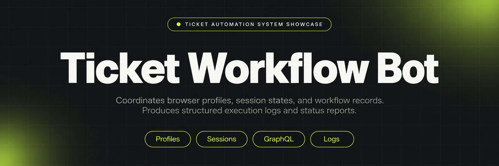
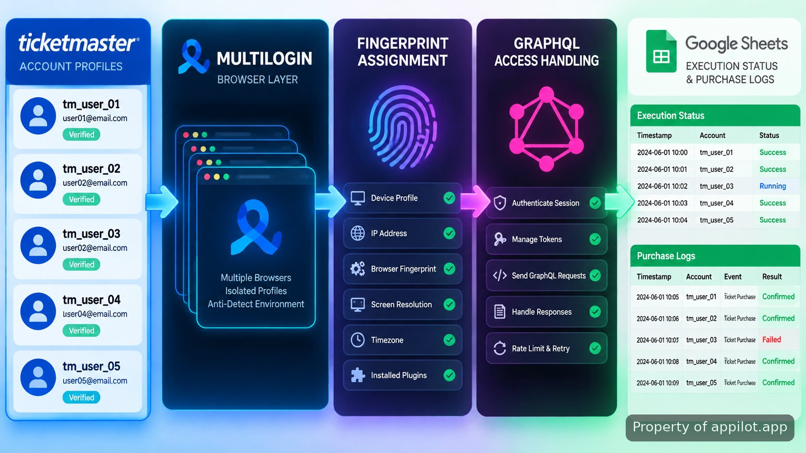

<p align="center">
  <a href="https://www.appilot.app" target="_blank" rel="nofollow">
    
  </a>
</p>

## Appilot's bots for ticketmaster

Appilot's bots for ticketmaster is a repository showcase for a browser automation system designed around multi-account coordination, session separation, and operational visibility. The system was built to handle large account groups where each profile needs its own browser environment, proxy routing, and status record. Instead of treating accounts as a single pool, the workflow keeps profile state, execution events, and purchase activity separated.

> A profile orchestration system for controlled Ticketmaster workflows.

The repository documents the architecture behind the automation, including Multilogin-based browser profiles, GraphQL access code handling for Verified Fan drops, Google Sheets reporting, and fingerprint-aware session management. The implementation connects browser actions with account health records so operators can see which profiles are ready, active, paused, or require review.

<a href="https://www.appilot.app" target="_blank" rel="nofollow">
  
</a>

<p align="center">
  <a href="https://t.me/Bitbash333" target="_blank" rel="nofollow">
    
  </a>&nbsp;
  <a href="https://wa.me/923249868488?text=Hi%2C%20I%27m%20interested%20in%20Appilot." target="_blank" rel="nofollow">
    
  </a>&nbsp;
  <a href="mailto:hello@appilot.app" target="_blank" rel="nofollow">
    
  </a>&nbsp;
  <a href="https://www.appilot.app" target="_blank" rel="nofollow">
    
  </a>
</p>

## Core Features

| Feature | Description |
| --- | --- |
| Multi-account profile orchestration | Managing hundreds of separate browser sessions manually creates account-state confusion. The system assigns each profile its own configuration, session data, and execution path through Multilogin stealth browser environments. |
| GraphQL access code extraction | Verified Fan workflows require structured request handling rather than repeated page inspection. The system captures GraphQL responses and extracts required access data during supported account flows. |
| Google Sheets status syncing | Tracking thousands of account events in scattered notes makes operational review difficult. The workflow writes health states, activity records, and purchase logs into Google Sheets through the Sheets API. |
| Fingerprint protection and proxy mapping | Shared browser fingerprints create account separation problems. The system applies isolated browser identities and assigns residential proxy connections across more than 2,500 account profiles. |
| Execution logging | Without run history, diagnosing failed sessions requires manual investigation. The system records profile actions, timestamps, and outcomes for later review. |

## Account orchestration workflow



The system is organized as a sequence of controlled stages. Account records enter the orchestration layer, where each profile receives its browser environment and network assignment. The execution layer then performs supported actions while collecting status information.

A typical workflow begins with a profile queue containing account identifiers and configuration data. The browser manager opens the matching Multilogin environment using isolated settings. Session events are passed through the automation layer, where GraphQL responses can be inspected and relevant access information is recorded. Completed actions are written back to the reporting layer.

The design separates execution from reporting. If a profile fails, the operator can identify the affected account, browser environment, and recorded event instead of reviewing every session manually.

## Multilogin stealth browser architecture

Account isolation depends on keeping browser environments separate. The system uses Multilogin profiles so each account workflow has its own browser storage, session context, and fingerprint configuration. Multilogin documentation describes profile-based browser environments for separating identities and sessions: <a href="https://docs.multilogin.com/" target="_blank" rel="nofollow">Multilogin documentation</a>.

The profile layer handles browser identity while the automation layer handles actions. This separation makes it possible to review individual sessions, rotate assignments, and maintain records without mixing account states.

```text
ticketmaster-automation-showcase/
├── app/
│   ├── orchestrator.py
│   ├── profile_manager.py
│   └── graphql_handler.py
├── config/
│   ├── profiles.yaml
│   └── proxy_map.yaml
├── logs/
│   └── execution.log
├── reports/
│   └── sheet_sync.py
└── README.md
```

<a href="https://tally.so/r/yP5oDx?platform=GitHub&amp;format=Product+repo&amp;brand=Appilot&amp;niche=appilot&amp;page=Bots+for+Ticketmaster+with+Multilogin&amp;date=2026-09-08" target="_blank" rel="nofollow">
  
</a>

## GraphQL access code extraction process

Modern web applications often exchange data through structured APIs. The system observes supported GraphQL traffic during account flows and extracts required response data rather than relying only on visible page elements. The GraphQL specification explains the query and response model used by GraphQL services: <a href="https://graphql.org/learn/" target="_blank" rel="nofollow">GraphQL documentation</a>.

The extraction layer focuses on identifying relevant response fields, validating returned values, and passing records to the execution log. This approach keeps the data path visible and easier to diagnose when an account flow changes.

## Google Sheets status syncing and reporting

Large profile collections require a central record of current state. The reporting module writes profile health, activity timestamps, and purchase events into Google Sheets through the official Sheets API. The API reference documents the available spreadsheet data operations: <a href="https://developers.google.com/sheets/api" target="_blank" rel="nofollow">Google Sheets API documentation</a>.

A sheet entry can represent a single account profile with fields such as profile identifier, last execution time, current status, and recorded event. With more than 2,500 assigned profiles, this reporting layer gives operators one place to review activity without opening each browser session.

## Residential proxy assignment and session control

Account groups with shared network paths create operational conflicts. The system maps residential proxy assignments to individual profiles so browser sessions maintain their configured routing. Proxy settings are treated as part of the profile configuration rather than a separate manual task.

The configuration layer stores profile-to-network relationships and passes those values into the browser environment before execution begins. This keeps session setup repeatable and makes troubleshooting easier when a profile requires review.

## Use Cases

- Automation operators managing large account collections can review profile status, execution history, and browser session health from a central reporting sheet.
- Ticketing operations handling Verified Fan workflows can organize browser profiles with separate environments and recorded session states.
- Technical teams maintaining account automation infrastructure can trace failed runs through logs, profile identifiers, and captured execution events.

## How to Run Appilot's bots for ticketmaster

- **STEP 1 — Download & Set Up the Project**
Get Appilot's bots for ticketmaster from the repository package, configure the environment files, and prepare the required browser profiles.
- **STEP 2 — Load Profiles**
Open the control interface and import profile records, Multilogin settings, and proxy mappings from the configuration files.
- **STEP 3 — Configure Execution**
Select profile groups, review GraphQL handling settings, and confirm Google Sheets reporting fields before starting.
- **STEP 4 — Run and Review Output**
Start the execution process and review browser events, account states, and purchase logs in the reporting sheet.

## Implementation Notes

The system is built around separation of responsibilities. Browser management handles profile environments, orchestration controls execution order, extraction handles structured responses, and reporting records outcomes. This structure makes each layer easier to inspect when platform behavior changes.

Automation projects that connect browsers, APIs, and reporting systems need clear boundaries between components. This repository presents those boundaries through configuration files, workflow diagrams, and operational examples. Related work includes custom browser automation and desktop stealth automation systems built around similar separation patterns.

## Technical References

The implementation references official documentation for the technologies involved. Browser automation workflows can use <a href="https://playwright.dev/docs/" target="_blank" rel="nofollow">Playwright documentation</a>, while secure software design practices can be reviewed through <a href="https://owasp.org/www-project-application-security-verification-standard/" target="_blank" rel="nofollow">OWASP automation and application security resources</a>.

## FAQ

### How does the system keep multiple Ticketmaster account sessions separated?

The system separates accounts by assigning individual browser profiles, session storage, and network configurations. Each profile is managed independently through the browser orchestration layer so account activity remains associated with its own environment.

### What data does the Google Sheets status syncing feature record?

The reporting layer records profile identifiers, execution states, timestamps, and purchase-related events. These records provide a central view of account health and workflow history.

### Why is GraphQL access code extraction used in this workflow?

GraphQL access code extraction allows the system to process structured application responses instead of depending only on visible page elements. The extraction layer identifies required response fields and passes validated records into the workflow.

<table>
  <tr>
    <td align="center" width="33%">
      
      <p>This scraper helped me gather thousands of posts effortlessly. The setup was fast, and exports are super clean and well-structured.</p>
      <p><b>Nathan Pennington</b><br>Marketer<br>★★★★★</p>
    </td>
    <td align="center" width="33%">
      
      <p>What impressed me most was how accurate the extracted data is. Likes, comments, timestamps — everything aligns perfectly.</p>
      <p><b>Greg Jeffries</b><br>SEO Affiliate Expert<br>★★★★★</p>
    </td>
    <td align="center" width="33%">
      
      <p>It's by far the best tool I've used. Ideal for trend tracking, competitor monitoring, and influencer insights.</p>
      <p><b>Karan</b><br>Digital Strategist<br>★★★★★</p>
    </td>
  </tr>
</table>